# Orion Uptime

<p aria-label="Orion project resources">
  <a href="https://orion-search.readthedocs.io" title="Read the Orion documentation">Orion documentation</a>
  &nbsp;·&nbsp;
  <a href="https://www.orionintelligence.org/" title="Orion Intelligence">orionintelligence.org</a>
  &nbsp;·&nbsp;
  <a href="https://github.com/Orion-Intelligence/Orion-Intelligence" title="Orion Platform repository">Orion Platform</a>
</p>

Orion Uptime is the availability monitoring and public status-page service of the Orion ecosystem. It continuously checks
HTTP endpoints, authenticated APIs, network hosts, and scheduled jobs, turns consecutive failures into incidents, streams
every change live to the operations dashboard, and publishes customer-facing status pages that need no account to view.

<p>
  <a href="client/src/assets/images/shared/orion-dashboard-dark.png">
    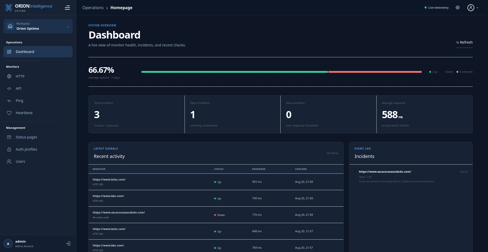
  </a>
  <br>
  <sub><strong>Operations Dashboard</strong> · Availability summary, live monitor states, incidents, and recent activity</sub>
</p>

The service is built the same way as the rest of the Orion Platform: a FastAPI backend on MongoDB, an Angular client,
and an nginx gateway, all packaged with Docker Compose and driven by a single `run.sh` for development and production.

## Quick Start

### Prerequisites

- Git and a Bash-compatible shell.
- Docker Engine with Docker Compose v2 (`docker compose`).
- A Node.js version matching `^20.19.0`, `^22.12.0`, or `>=24.0.0`, with npm.
- OpenSSL, used by the local build script to create the development certificate.
- Python 3.12 with a virtual environment in `.venv` if you want to run the backend tests and linters outside Docker.

<details>
<summary><strong>Install and configure</strong> · build and run Orion Uptime locally</summary>

<br>

```bash
git clone https://github.com/Orion-Intelligence/Orion-Uptime.git
cd Orion-Uptime
cp template-env .env
```

Open `.env` and replace every placeholder before starting the stack. Generate the application secrets with:

```bash
openssl rand -hex 32
openssl rand -base64 32 | tr '+/' '-_'
```

Use the first value for `JWT_SECRET` and the second for `CREDENTIALS_ENCRYPTION_KEY` (it must stay a 32-byte
URL-safe Base64 key). Set strong, distinct values for `MONGO_ROOT_PASSWORD`, `MONGO_APP_PASSWORD`, and
`DEFAULT_ADMIN_PASSWORD`. The `.env` file is ignored by Git and must never be committed.

### Build and start

```bash
chmod +x run.sh
./run.sh build
```

After the services become healthy, open [http://127.0.0.1:8600](http://127.0.0.1:8600). Local HTTPS is also available
at `https://127.0.0.1:8643` with a generated self-signed certificate. Sign in with `DEFAULT_ADMIN_USERNAME` and
`DEFAULT_ADMIN_PASSWORD`, then change the password from the Users page.

For later starts or shutdowns:

```bash
./run.sh
./run.sh stop
```

</details>

<details>
<summary><strong>All run.sh commands</strong></summary>

<br>

| Command               | What it does                                                                                               |
|-----------------------|------------------------------------------------------------------------------------------------------------|
| `./run.sh build`      | Install client dependencies, build the client, build images with `--pull`, and start the development stack |
| `./run.sh build -d`   | Build and start the backend only, with live reload on `backend/app` changes (pair with `./run.sh serve`)   |
| `./run.sh build -b`   | Rebuild images and start the stack, reusing the existing client build                                      |
| `./run.sh build -p`   | Same as `./run.sh production`                                                                              |
| `./run.sh serve`      | Start the stack and run the Angular dev server on `http://127.0.0.1:4300` (proxies `/api` to the gateway)  |
| `./run.sh production` | Build the client and images and start the production stack on ports 80 and 443                             |
| `./run.sh lint`       | Lint the client (eslint + stylelint) and the backend (ruff); `-f` applies the available auto-fixes         |
| `./run.sh test`       | Run the backend test suite (pytest)                                                                        |
| `./run.sh stop`       | Stop the Angular dev server and whichever stack is running                                                 |

</details>

## Platform Preview

<details>
  <summary><strong>Screenshot Gallery</strong> · Browse the Orion Uptime screens</summary>
  <br>
  <table>
    <tr>
      <td><a href="client/src/assets/images/shared/orion-login-dark.png">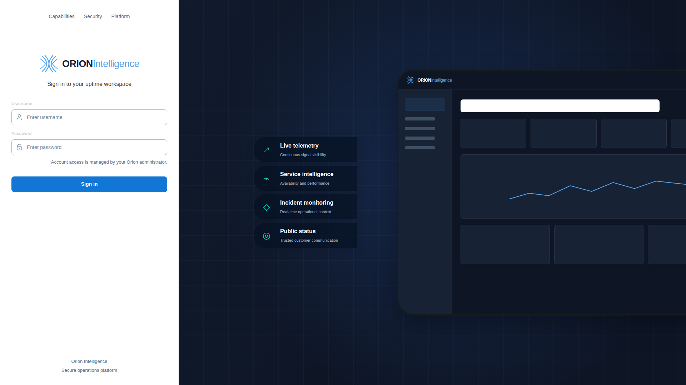</a><br><sub>Sign in</sub></td>
      <td><a href="client/src/assets/images/shared/orion-dashboard-dark.png"></a><br><sub>Dashboard</sub></td>
      <td><a href="client/src/assets/images/shared/orion-dashboard-collapsed.png">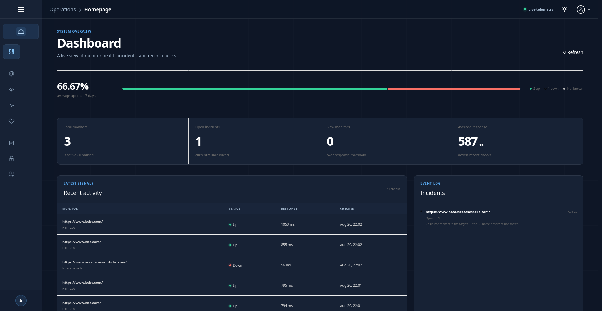</a><br><sub>Dashboard · collapsed navigation</sub></td>
    </tr>
    <tr>
      <td><a href="client/src/assets/images/shared/orion-dashboard-light-collapsed.png">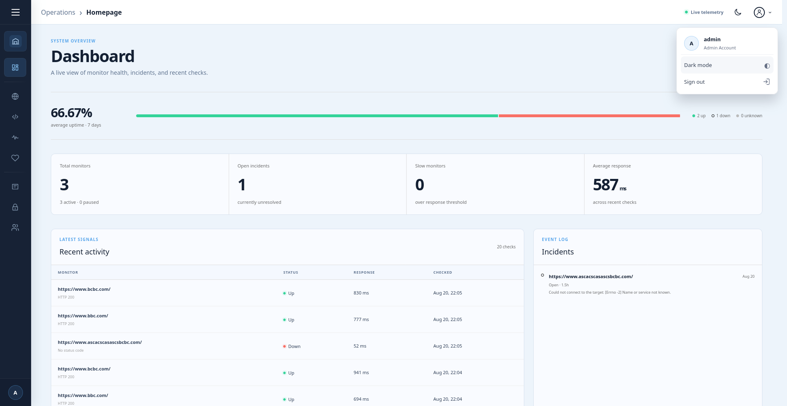</a><br><sub>Dashboard · light theme</sub></td>
      <td><a href="client/src/assets/images/shared/orion-http-list.png">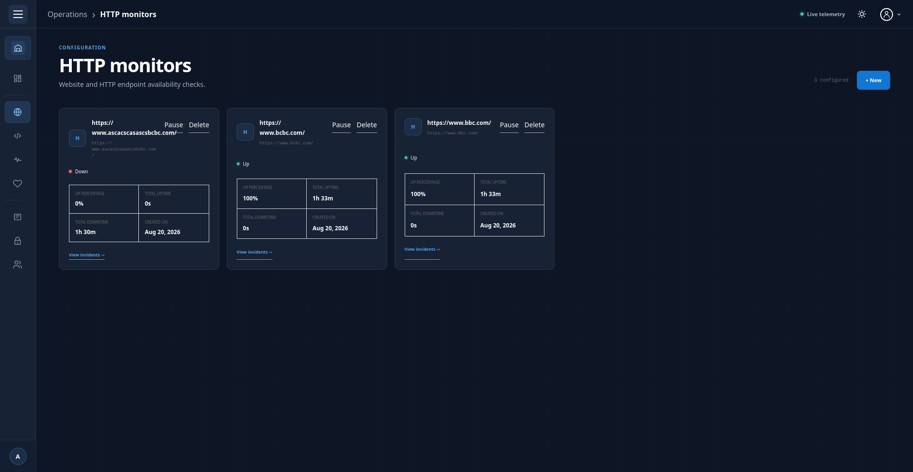</a><br><sub>HTTP monitors</sub></td>
      <td><a href="client/src/assets/images/shared/orion-add-monitor.png">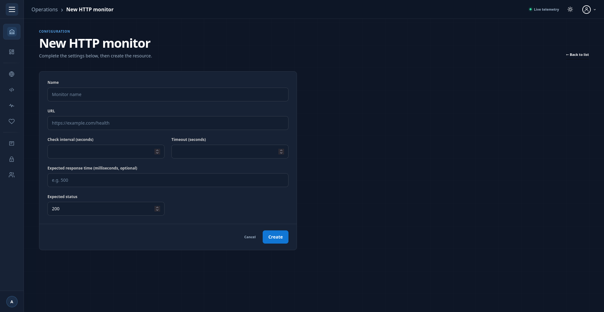</a><br><sub>Add a monitor</sub></td>
    </tr>
    <tr>
      <td><a href="client/src/assets/images/shared/orion-status-pages.png">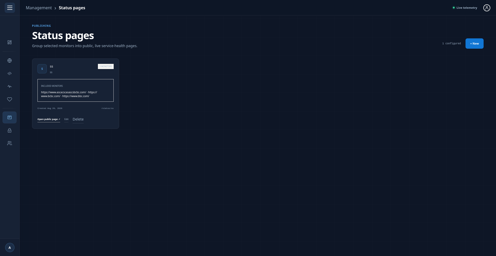</a><br><sub>Status pages</sub></td>
      <td><a href="client/src/assets/images/shared/orion-status-pages-new.png">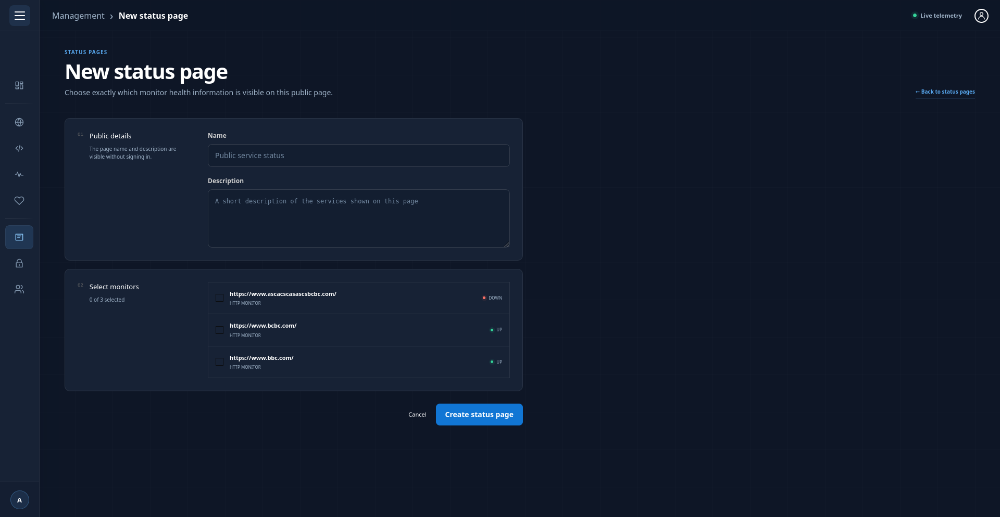</a><br><sub>New status page</sub></td>
      <td><a href="client/src/assets/images/shared/orion-users-new.png">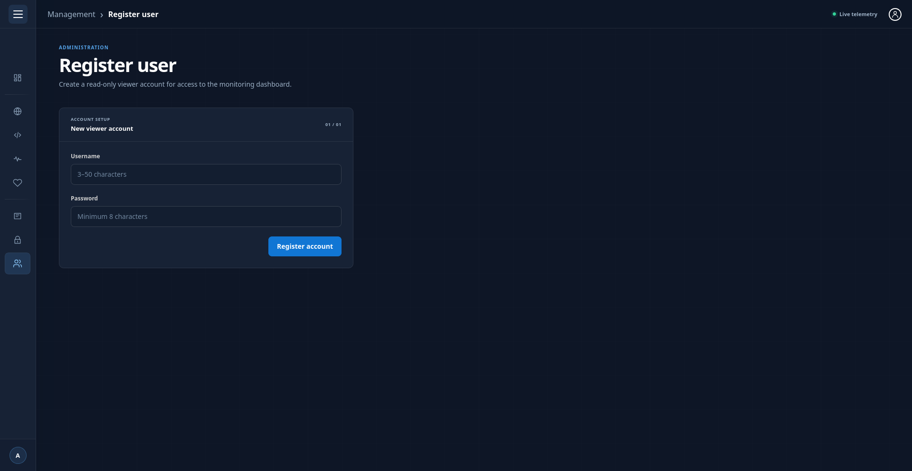</a><br><sub>Register a user</sub></td>
    </tr>
    <tr>
      <td><a href="client/src/assets/images/shared/orion-profile-dropdown.png">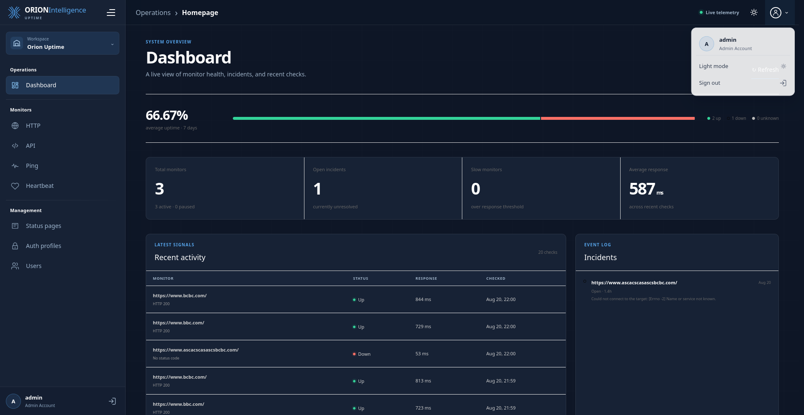</a><br><sub>Profile menu</sub></td>
      <td><a href="client/src/assets/images/shared/orion-login-mobile.png">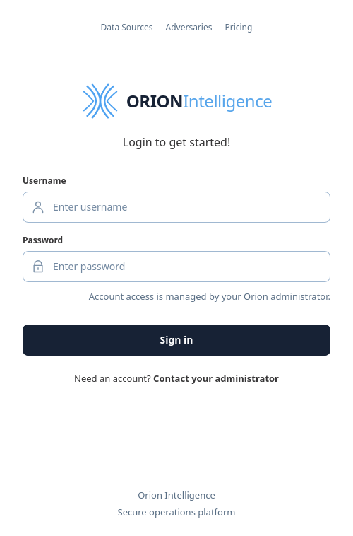</a><br><sub>Sign in · mobile</sub></td>
      <td><a href="client/src/assets/images/shared/orion-dashboard-mobile.png">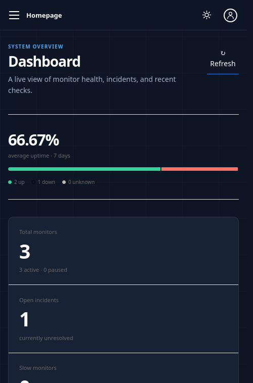</a><br><sub>Dashboard · mobile</sub></td>
    </tr>
    <tr>
      <td colspan="3"><a href="client/src/assets/images/shared/orion-mobile-drawer.png">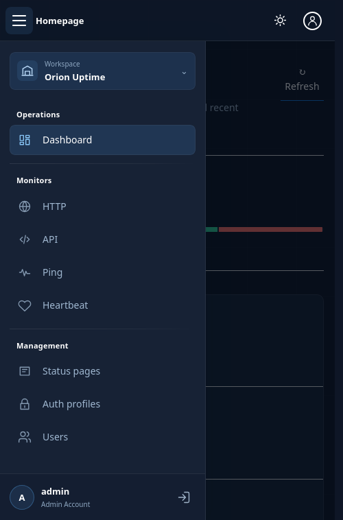</a><br><sub>Navigation drawer · mobile</sub></td>
    </tr>
  </table>
</details>

## Core Capabilities

- **HTTP monitors** check a URL on a fixed interval and compare the status code and response time with the expected values.
- **API monitors** send configurable requests, validate status, headers, content type, and JSON, and can authenticate
  against an Orion Platform login through a stored auth profile whose credentials are encrypted at rest.
- **Ping monitors** verify host reachability with ICMP and fall back to TCP reachability on ports 443, 53, and 80.
- **Heartbeat monitors** expect periodic check-ins from cron jobs and workers and raise an incident when one is missed.
- **Failure and recovery thresholds** (`MONITOR_FAILURE_THRESHOLD`, `MONITOR_RECOVERY_THRESHOLD`) keep single blips from
  opening incidents; every transition is recorded with a human-readable reason.
- **Live dashboard** updates through server-sent events, with response-time and status history per monitor.
- **Public status pages** group monitors under a slug (`/status/<slug>`), show 90-day history and 24h/7d/30d/90d uptime,
  and are readable without any account.
- **Role-based access**: administrators manage monitors, auth profiles, status pages, and users; viewers see the dashboard.

## Architecture Overview

| Service       | Image                                                       | Role                                                                                                                                                           |
|---------------|-------------------------------------------------------------|----------------------------------------------------------------------------------------------------------------------------------------------------------------|
| `nginx`       | `nginx:1.31-alpine`                                         | Gateway: serves the Angular build, proxies `/api`, terminates TLS, and in production obtains and renews the Let's Encrypt certificate with nginx's ACME module |
| `backend`     | `backend/Dockerfile` (Ubuntu 24.04, Python 3.12, Hypercorn) | FastAPI API, the monitor scheduler, the real-time broker, and the seed job                                                                                     |
| `mongodb`     | `mongo:7.0`                                                 | Monitors, results, incidents, users, status pages                                                                                                              |
| `seed`        | `backend/Dockerfile`                                        | One-shot job that creates the least-privilege application database user and the default administrator                                                          |
| `status-test` | `kennethreitz/httpbin`                                      | Development only: a local target to point test monitors at                                                                                                     |

```text
backend/app/      FastAPI application (routes, modules, services), tests in backend/tests
client/           Angular application; the production build is served by nginx from client/build
nginx/            nginx.conf, reusable snippets, dev and production server templates, local certificates
docker-compose.yml              development stack (gateway on APP_PORT / APP_HTTPS_PORT)
docker-compose-production.yml   production stack (gateway on 80 / 443)
run.sh            build, start, stop, lint, test, and production entry point
```

The scheduler runs one worker per active monitor and reconciles every 30 seconds, restarting workers that stopped and
picking up monitors that were added, paused, or removed. Every check runs under a hard deadline, `/api/health` reports
the scheduler state (and returns 503 when it stalls), and all long-running containers use `restart: always`, so the
stack recovers on its own from crashes.

## Configuration

| Variable                                                                                  | Purpose                                                                                                                                                                |
|-------------------------------------------------------------------------------------------|------------------------------------------------------------------------------------------------------------------------------------------------------------------------|
| `APP_NAME`, `APP_VERSION`                                                                 | Shown in the API metadata                                                                                                                                              |
| `APP_ENV`                                                                                 | `development`, `local`, or `test` keep the OpenAPI docs on and cookies non-`Secure`; anything else is treated as production (the production stack forces `production`) |
| `APP_PORT`, `APP_HTTPS_PORT`                                                              | Host ports of the development gateway (default `8600` / `8643`)                                                                                                        |
| `PRODUCTION_DOMAIN`, `LETSENCRYPT_EMAIL`                                                  | Public hostname and contact address used by the production gateway to request its certificate                                                                          |
| `DATABASE_NAME`, `MONGO_ROOT_USERNAME`, `MONGO_ROOT_PASSWORD`                             | MongoDB database name and the root account used only by the seed job                                                                                                   |
| `MONGO_APP_USERNAME`, `MONGO_APP_PASSWORD`                                                | Read/write application account the backend connects with                                                                                                               |
| `JWT_SECRET`, `JWT_ALGORITHM`, `ACCESS_TOKEN_EXPIRE_MINUTES`, `REFRESH_TOKEN_EXPIRE_DAYS` | Session tokens (15-minute access tokens, 7-day rotating refresh tokens, HttpOnly cookies)                                                                              |
| `TRUSTED_PROXIES`                                                                         | Comma-separated IPs or CIDRs whose `X-Forwarded-For` is trusted for client addresses; the production stack sets it to the gateway network                              |
| `CREDENTIALS_ENCRYPTION_KEY`                                                              | Fernet key that encrypts auth-profile credentials in the database                                                                                                      |
| `DEFAULT_ADMIN_USERNAME`, `DEFAULT_ADMIN_PASSWORD`                                        | Administrator created on first start; the backend logs a warning while this password is still in use                                                                   |
| `MONITOR_FAILURE_THRESHOLD`, `MONITOR_RECOVERY_THRESHOLD`                                 | Consecutive failed or successful checks before a monitor goes down or recovers                                                                                         |
| `MONITOR_RESULT_RETENTION_DAYS`                                                           | TTL for stored check results (default 180 days)                                                                                                                        |
| `MONITOR_ALLOW_PRIVATE_TARGETS`                                                           | Allow monitors to target private, loopback, and link-local addresses (`true` for local development, `false` for public deployments)                                    |

## Production Deployment

The production stack is deployed at `https://uptime.orionintelligence.org`.

1. Point the DNS record of `PRODUCTION_DOMAIN` at the server and allow inbound traffic on ports 80 and 443.
2. Set `PRODUCTION_DOMAIN` and `LETSENCRYPT_EMAIL` in `.env`; the script refuses to start without them.
3. Run `./run.sh production` (or `./run.sh build -p`).

nginx answers on port 80, redirects to HTTPS, and requests, installs, and renews the Let's Encrypt certificate itself;
the first TLS handshakes fail for a few seconds until the certificate has been issued. The production containers run
read-only with all Linux capabilities dropped, the backend runs as a non-root user without live reload, and the API is
only reachable through the gateway. Keep the backend at a single Hypercorn worker: the scheduler, login throttling, and
token revocation are process-local by design.

## Security

- Cookie-only session authentication (`HttpOnly`, `SameSite=Lax`, `Secure` outside development) with rotating refresh
  tokens, access-token revocation on logout, and login throttling per account and client address.
- Auth-profile credentials are encrypted at rest; the backend uses a database account limited to its own database.
- A strict Content Security Policy and the usual hardening headers are sent by the API and by nginx for static files;
  HSTS is enabled in production.
- Container images are kept free of known critical and high vulnerabilities; rebuild with `./run.sh build` or
  `./run.sh production` regularly so base-image fixes are pulled in.

Please report suspected vulnerabilities privately according to the [Security Policy](SECURITY.md). Do not open a public
issue for a security vulnerability.

## Orion Ecosystem

Orion Uptime watches over the services of the [Orion Platform](https://github.com/Orion-Intelligence/Orion-Intelligence)
and can monitor any other HTTP service, API, host, or scheduled job. Its API monitors understand Orion Platform logins,
so authenticated Orion endpoints can be checked with a stored auth profile instead of a static token. The platform
documentation lives at [orion-search.readthedocs.io](https://orion-search.readthedocs.io).

## Contribution

We welcome contributions to improve Orion Uptime. If you'd like to contribute, please fork the repository and submit a
pull request.

### Steps to Contribute

1. Fork the repository.
2. Create a new feature branch (`git checkout -b feature-branch`).
3. Run `./run.sh lint` and `./run.sh test` before committing.
4. Commit your changes (`git commit -m 'Add some feature'`).
5. Push to the branch (`git push origin feature-branch`).
6. Create a new Pull Request.

## License

Orion Uptime is distributed under the terms described in [LICENSE](LICENSE).

## Disclaimer

This project is intended for monitoring systems you own or are authorized to monitor. The authors of Orion Uptime do not
support or endorse illegal activities, and users of this project are responsible for ensuring their actions comply with
the law.

## Project Links

- [Orion Intelligence](https://www.orionintelligence.org/)
- [Orion Platform repository](https://github.com/Orion-Intelligence/Orion-Intelligence)
- [Orion documentation](https://orion-search.readthedocs.io/en/latest/app_docs/introduction_to_platform.html)
- [Genesis Technologies](https://genesistechnologies.org/)
